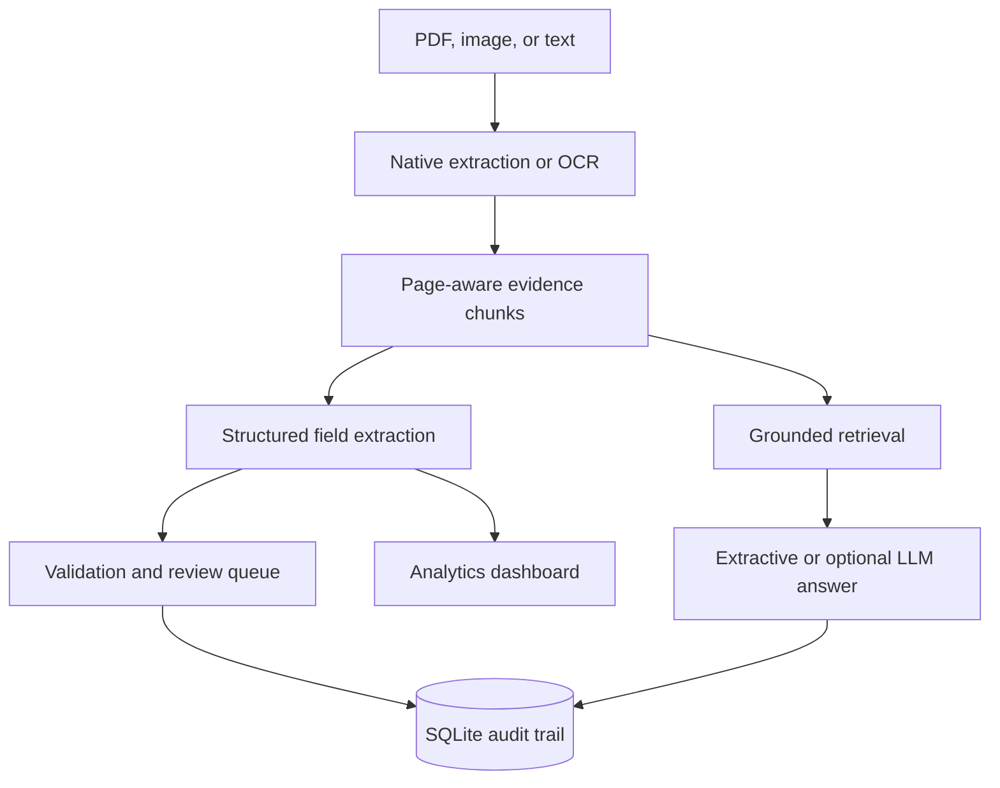

# PolicyLens

Evidence-first document intelligence for synthetic life-insurance product
information.

Created by [Arkamitra Bhattacharyya](https://github.com/arkamitrab).

## Purpose

Life-insurance product information often arrives in PDFs, scanned pages,
images, and inconsistently formatted reference documents. PolicyLens shows how
these sources can be converted into structured, traceable product data without
hiding uncertainty.

The project is designed to demonstrate practical skills in Python, OCR,
document processing, data validation, grounded retrieval, responsible use of
LLMs, analytics dashboards, and workflow automation. It is a portfolio
application—not an underwriting, claims, or financial-advice system.

## Core functionality

| Capability | Implementation | Why it matters |
|---|---|---|
| Multi-format ingestion | Markdown, text, native PDFs, scanned PDFs, PNG, JPG, and TIFF | Handles varied reference formats |
| OCR | Tesseract, Pillow, and page-rendering fallback | Recovers text from images and scanned PDF pages |
| Structured extraction | Deterministic extraction of product, cover, age, benefit, premium, and exclusion fields | Creates consistent reference data |
| Validation and review | Required-field, range, and completeness checks | Makes missing or inconsistent data visible |
| Grounded Q&A | TF-IDF retrieval, page citations, and weak-evidence abstention | Keeps answers traceable to source evidence |
| Optional LLM synthesis | OpenAI synthesis restricted to retrieved evidence | Adds concise synthesis without replacing controls |
| Analytics dashboard | KPIs, filters, charts, exception tables, and CSV export | Shows portfolio readiness and extracted values |
| Product comparison | Side-by-side structured product table | Supports quick review across products |
| Audit trail | SQLite document-processing and question events | Preserves operational traceability |
| Delivery controls | Automated tests, GitHub Actions, Docker, and Streamlit configuration | Makes the project reproducible and deployable |

## Sample dashboard results

Loading the three bundled synthetic product documents produces the following
dashboard summary:

| Metric | Sample result |
|---|---:|
| Products processed | 3 |
| Records ready for use | 3 of 3 (100%) |
| Mean required-field coverage | 100% |
| Validation exceptions | 0 |
| Evidence chunks created | 6 |

| Product | Maximum sum insured | Waiting-period options | Status |
|---|---:|---|---|
| HarbourLife Secure Term | AUD $3,000,000 | 0 days | Ready |
| Southern Horizon Income Protection | AUD $30,000 | 30, 60, and 90 days | Ready |
| Coral Mutual Trauma Select | AUD $2,000,000 | 90 days | Ready |

The waiting-period chart shows one product at 0 days, one at 30 days, one at 60
days, and two at 90 days. Dashboard filters allow the results to be narrowed by
provider and review status, and the filtered data can be downloaded as CSV.

These values come from the bundled fictitious documents and demonstrate the
workflow; they are not performance benchmarks or real insurance products.

## OCR example

The repository includes `data/sample/scanned_demo.png`. When it is uploaded,
PolicyLens produces this result:

| OCR output | Extracted value |
|---|---|
| Extraction method | `ocr` |
| Product | Wattle Life Essentials |
| Provider | Wattle Life (Fictitious) |
| Maximum sum insured | AUD $1,500,000 |
| Field coverage | 100% |
| Review status | Ready |

For PDF files, PolicyLens first attempts native text extraction. If a page has
fewer than 40 embedded characters, the page is rendered at higher resolution
and processed using the `ocr-fallback` path. Both image OCR and scanned-PDF OCR
fallback are covered by automated tests.

## Architecture



The workflow is coordinated by `PolicyWorkflow`. Native extraction and OCR
preserve page-level provenance before the content is chunked. Structured records
and validation results feed the comparison and dashboard views, while the same
evidence chunks support grounded retrieval. Processing and question events are
written to SQLite.

The deterministic extraction and retrieval workflow works without an API key.
OpenAI synthesis is optional and only receives retrieved evidence.

## Run locally

### macOS

```bash
git clone https://github.com/arkamitrab/PolicyLens.git
cd PolicyLens

python3 -m venv .venv
source .venv/bin/activate
python -m pip install --upgrade pip
python -m pip install -r requirements.txt

brew install tesseract
python -m streamlit run app.py
```

Open `http://localhost:8501`.

Tesseract is required only for images and scanned-PDF OCR. Native text and
text-based PDFs continue to work without it.

## Try the application

### Product dashboard

1. Select **Load three synthetic products** in the sidebar.
2. Open **Analytics dashboard**.
3. Review product limits, field coverage, waiting periods, ingestion methods,
   and validation exceptions.
4. Open **Product comparison** to inspect the structured records.

### OCR

1. Upload `data/sample/scanned_demo.png`.
2. Select **Process uploads**.
3. Confirm that **Wattle Life Essentials** appears in the portfolio.
4. Open **Review & audit** and verify that the extraction method is `ocr`.

### Grounded Q&A

Load the sample products and ask:

```text
Which product offers a 30-day waiting period?
```

The response includes source citations. Questions unsupported by the documents
produce an abstention instead of a guessed answer.

## Optional LLM mode

Copy the environment template:

```bash
cp .env.example .env
```

Add your values without committing the file:

```dotenv
OPENAI_API_KEY=your-key
OPENAI_MODEL=gpt-5-mini
```

OCR, extraction, validation, the dashboard, and extractive grounded Q&A do not
require an OpenAI API key.

## Tests

```bash
PYTHONPATH=src python -m unittest discover -s tests -v
```

The nine tests cover structured extraction, image OCR, scanned-PDF OCR fallback,
validation, citations, weak-evidence abstention, deduplication, audit persistence,
and dashboard summaries.

GitHub Actions runs the test suite on Python 3.11 and 3.12. Tesseract is installed
in the workflow so both OCR paths are tested on every push and pull request to
`main`.

## Deploy on Streamlit Community Cloud

1. Sign in to <https://share.streamlit.io> with GitHub.
2. Select **Create app**.
3. Choose `arkamitrab/PolicyLens`, branch `main`, and entrypoint `app.py`.
4. Select **Deploy**.

The root-level `packages.txt` installs the Tesseract executable on Streamlit
Community Cloud. `requirements.txt` installs the Python dependencies. No secret
is needed unless optional LLM synthesis is enabled.

## Docker

```bash
docker build -t policylens .
docker run --rm -p 8501:8501 policylens
```

The Docker image includes Tesseract, so OCR works inside the container.

## Project structure

```text
PolicyLens/
├── app.py                         # Streamlit interface and dashboard
├── data/sample/                   # Synthetic documents and OCR image
├── packages.txt                   # Tesseract for Streamlit Cloud
├── requirements.txt               # Python dependencies
├── src/policylens/                # Ingestion, extraction, retrieval, and audit
├── tests/test_policylens.py       # Nine automated tests
├── .github/workflows/ci.yml       # Continuous integration
└── Dockerfile                     # Container deployment with OCR support
```

## Key design decisions

1. **Deterministic core:** extraction, validation, retrieval, comparison, and
   dashboard reporting remain usable without an LLM or API key.
2. **Evidence before answers:** page-aware chunks and citations let reviewers
   inspect the source behind an extracted value or response.
3. **Visible uncertainty:** missing fields and weak retrieval results produce a
   review task or abstention instead of a confident-looking guess.
4. **Human review:** extracted records are reference drafts and remain subject
   to validation against the original document.
5. **Separable components:** ingestion, extraction, analytics, retrieval, and
   auditing are isolated modules that can be tested or replaced independently.
6. **Scalable path:** object storage, a managed database, a vector index, and
   queued processing could replace the local demo components in production.

## Responsible use

All bundled insurers, products, values, and terms are fictitious. Do not upload
confidential information to a public deployment. Extracted values should be
reviewed against their sources and must not be used for underwriting, claims,
eligibility, or financial-advice decisions.

## Licence

MIT © 2026 Arkamitra Bhattacharyya.
