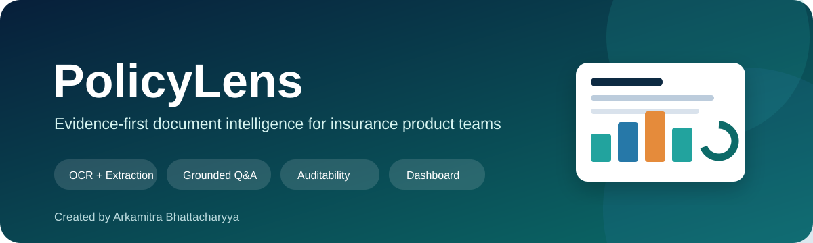
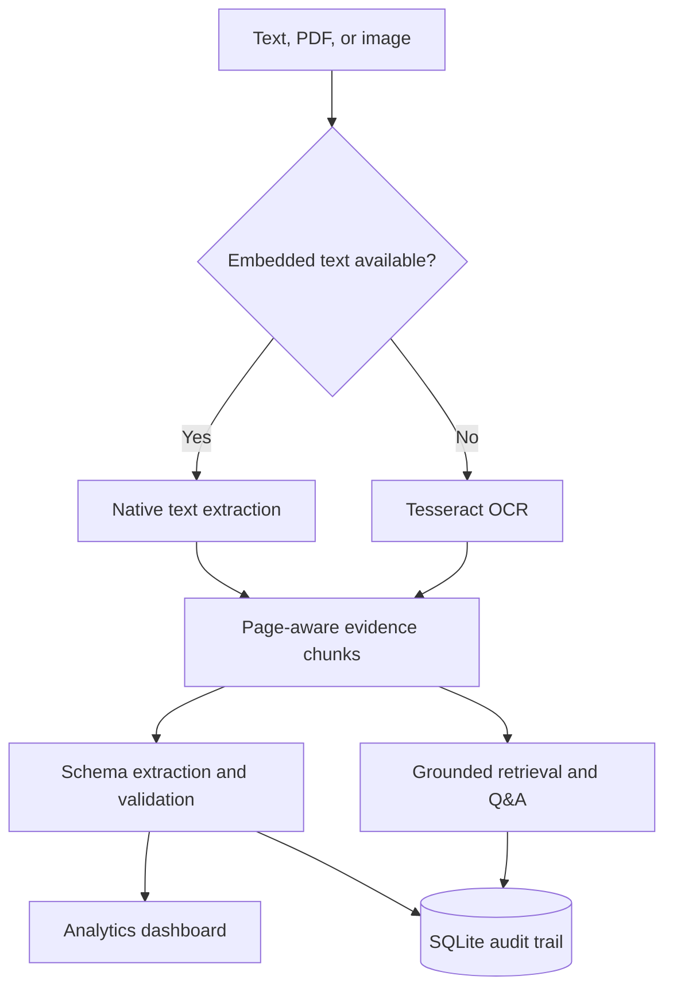

<p align="center">
  
</p>

<p align="center">
  <a href="https://github.com/arkamitrab/PolicyLens/actions/workflows/ci.yml">
    
  </a>
  
  
  
  
</p>

# PolicyLens

PolicyLens is an evidence-first document-intelligence workbench for synthetic
life-insurance product information. It accepts native documents and scanned
files, extracts structured product terms, identifies records that need human
review, supports citation-grounded Q&A, and turns the resulting portfolio into
an interactive analytics dashboard.

**Created by [Arkamitra Bhattacharyya](https://github.com/arkamitrab).**

> All bundled insurers, products, limits, and terms are fictitious. PolicyLens
> is a technical demonstration, not financial advice and not a representation
> of Munich Re or any insurer.

## Why PolicyLens

Product and operational references often arrive as PDFs, scans, images, and
inconsistently formatted text. Extracting text is only the first step: insurance
teams also need provenance, validation, exception handling, auditability, and a
clear way to inspect portfolio-level results.

PolicyLens demonstrates that end-to-end workflow while keeping a deterministic,
fully offline core. Generative AI is optional and is restricted to retrieved
source evidence.

## Key capabilities

| Capability | Implementation | Outcome |
|---|---|---|
| OCR and document ingestion | Tesseract OCR, Pillow, and PyMuPDF | Reads images, native PDFs, scanned PDF pages, Markdown, and text |
| Structured extraction | Deterministic parsing into a life-insurance product schema | Produces comparable, reviewable records |
| Data-quality controls | Required-field, range, and completeness checks | Routes incomplete or inconsistent records to review |
| Grounded Q&A | TF-IDF retrieval, page citations, and weak-evidence abstention | Keeps answers traceable to their source |
| Optional LLM synthesis | OpenAI Responses API over retrieved evidence only | Adds concise synthesis without removing controls |
| Analytics dashboard | KPIs, charts, filters, exception tables, and CSV export | Shows readiness and portfolio insights |
| Audit trail | SQLite processing and Q&A event logs | Preserves operational traceability |
| Deployment | GitHub Actions, Streamlit configuration, and Docker | Provides a reproducible delivery path |

## OCR workflow

OCR is a built-in capability, not a placeholder.

- **Image uploads:** PNG, JPG, JPEG, TIFF, and TIF files are normalised with
  Pillow and processed with Tesseract.
- **Native PDFs:** PyMuPDF extracts embedded text directly.
- **Scanned PDFs:** if a PDF page contains fewer than 40 embedded characters,
  PolicyLens renders that page at higher resolution and automatically applies
  OCR fallback.
- **Provenance:** every page records `native-text`, `pdf-text`, `ocr`, or
  `ocr-fallback` as its extraction method.
- **Validation:** OCR output is passed through the same schema extraction and
  human-review checks as native text.

The repository includes `data/sample/scanned_demo.png`. The automated OCR test
extracts **Wattle Life Essentials**, its provider, cover limits, and policy
fields from that image, then verifies that the resulting record is ready for
review.

## Architecture



## Analytics dashboard

The dashboard turns processed records into an operational view with:

- products in scope, readiness rate, and mean extraction confidence;
- maximum sum insured by product;
- field-level evidence coverage;
- waiting-period availability;
- native-text and OCR ingestion-method counts;
- validation exceptions and review gaps;
- audited grounded-question volume; and
- filtered CSV export.

Filters allow the portfolio to be narrowed by provider and review status.

## Quick start

### macOS

```bash
git clone https://github.com/arkamitrab/PolicyLens.git
cd PolicyLens
python3 -m venv .venv
source .venv/bin/activate
python -m pip install --upgrade pip
python -m pip install -r requirements.txt
brew install tesseract
python -m streamlit run app.py
```

### Windows PowerShell

```powershell
git clone https://github.com/arkamitrab/PolicyLens.git
cd PolicyLens
py -m venv .venv
.\.venv\Scripts\Activate.ps1
python -m pip install --upgrade pip
python -m pip install -r requirements.txt
python -m streamlit run app.py
```

Tesseract must also be installed on Windows and available on the system `PATH`
for image and scanned-PDF OCR.

Open `http://localhost:8501` after Streamlit starts.

## Run the demos

### Structured portfolio and dashboard

1. Select **Load three synthetic products** in the sidebar.
2. Open **Analytics dashboard** to inspect coverage and product metrics.
3. Open **Product comparison** to compare extracted terms.
4. Ask `Which product offers a 30-day waiting period?` under **Grounded Q&A**.

### OCR demonstration

1. Upload `data/sample/scanned_demo.png` from the sidebar.
2. Select **Process uploads**.
3. Confirm that **Wattle Life Essentials** appears in the portfolio.
4. Open **Review & audit** and verify that the extraction method is `ocr`.
5. Open **Analytics dashboard** to see the OCR page represented under
   **Ingestion methods**.

The sidebar displays **OCR engine ready** whenever the Tesseract executable is
available.

## Deploy on Streamlit Community Cloud

The repository is prepared for Streamlit Community Cloud:

- `requirements.txt` installs Python dependencies, including `pytesseract`;
- `packages.txt` installs the system-level `tesseract-ocr` executable; and
- `.streamlit/config.toml` supplies the application theme and server settings.

To deploy:

1. Sign in to <https://share.streamlit.io> with GitHub.
2. Select **Create app**.
3. Choose `arkamitrab/PolicyLens` and branch `main`.
4. Set the entrypoint to `app.py`.
5. Select **Deploy**.

No API key is required for OCR, extraction, retrieval, validation, comparison,
or the dashboard.

## Optional grounded LLM mode

The default answerer works locally. To enable evidence-constrained OpenAI
synthesis, copy the environment template:

```bash
cp .env.example .env
```

Then add:

```dotenv
OPENAI_API_KEY=your-key
OPENAI_MODEL=gpt-5-mini
```

The `.env` file is excluded from Git. Never commit an API key. For a cloud
deployment, add the same values through the platform's secrets interface.

## Tests

```bash
PYTHONPATH=src python -m unittest discover -s tests -v
PYTHONPATH=src python scripts/run_demo.py
```

The nine tests cover:

- structured product extraction;
- scanned-image OCR;
- scanned-PDF OCR fallback;
- source-grounded answers and citations;
- weak-evidence abstention;
- validation and review routing;
- document deduplication;
- SQLite audit persistence; and
- dashboard summaries.

GitHub Actions installs Tesseract and runs the suite on Python 3.11 and 3.12 for
every push and pull request to `main`.

## Docker

The Docker image installs Tesseract, so OCR works inside the container:

```bash
docker build -t policylens .
docker run --rm -p 8501:8501 policylens
```

Then open `http://localhost:8501`.

## Repository structure

```text
PolicyLens/
├── .github/workflows/ci.yml       # Python and OCR tests
├── .streamlit/config.toml         # UI and server configuration
├── app.py                         # Streamlit application and dashboard
├── data/sample/                   # Synthetic references and OCR test image
├── docs/policylens-banner.svg     # README banner
├── packages.txt                   # Tesseract for Streamlit Cloud
├── scripts/run_demo.py            # Offline end-to-end demonstration
├── src/policylens/
│   ├── agents.py                  # Workflow coordination
│   ├── analytics.py               # Dashboard summaries
│   ├── audit.py                   # SQLite persistence
│   ├── extract.py                 # Field extraction and validation
│   ├── ingest.py                  # Native text, PDF, and OCR ingestion
│   ├── llm.py                     # Optional grounded LLM synthesis
│   ├── models.py                  # Domain models
│   └── retrieval.py               # Retrieval and citations
├── tests/test_policylens.py       # Nine automated tests
├── Dockerfile                     # Container deployment with Tesseract
├── LICENSE                        # MIT licence
└── requirements.txt               # Python dependencies
```

## Responsible-use boundaries

- Do not upload confidential, personal, or commercially sensitive information
  to a public deployment.
- Treat extracted values as draft reference data until reviewed against source
  evidence.
- Do not use this application for underwriting, claims decisions, financial
  advice, or automated eligibility decisions.
- Use licensed and approved source documents in a production environment.

## Author and licence

Created by **Arkamitra Bhattacharyya**.

Released under the [MIT License](LICENSE).
